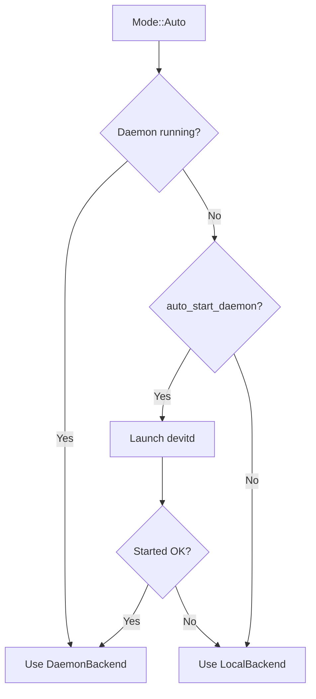

# DevIt Orchestration Architecture

## Overview

DevIt delivers multi-AI orchestration with seamless hand-off between assistants such as Claude Desktop, Claude Code, and Cursor. The system persists task state, enforces security policies, and supports automatic failover between daemon and local modes.

Every delegated task is bound to a sandbox-relative working directory. This keeps multi-repo sessions isolated (for example, `project-a/` vs `experiments/test-1/`) while still enforcing the global jail configured under `[workspace]`.

## Architecture Layers

### 1. Backend Trait (`OrchestrationBackend`)

Core abstraction shared by all orchestration implementations:

```rust
#[async_trait::async_trait]
pub trait OrchestrationBackend {
    async fn delegate(
        &self,
        goal: String,
        delegated_to: String,
        timeout: Option<std::time::Duration>,
        watch_patterns: Option<Vec<String>>,
        context: Option<serde_json::Value>,
        working_dir: Option<std::path::PathBuf>,
        response_format: Option<String>,
    ) -> anyhow::Result<devit_orchestration::types::DelegateResult>;

    async fn notify(
        &self,
        task_id: &str,
        status: &str,
        summary: &str,
        details: Option<serde_json::Value>,
        evidence: Option<serde_json::Value>,
    ) -> anyhow::Result<()>;

    async fn status(
        &self,
        filter: devit_orchestration::types::StatusFilter,
    ) -> anyhow::Result<devit_orchestration::types::OrchestrationStatus>;

    async fn cleanup_expired(&self) -> anyhow::Result<()>;
}
```

### 2. Implementations

- **LocalBackend**
  - Pure in-memory tracking
  - Single-session scope
  - Zero external dependencies
  - Ideal for unit tests and CI
  - Persists the sandbox-relative working directory in each `DelegatedTask`

- **DaemonBackend**
  - Talks to the persistent `devitd` process over a Unix socket
  - Cross-session task persistence and monitoring
  - Auto-launch capability with fallback to local backend
  - Shared state is cached locally to provide quick status queries
  - Echoes the `working_dir` in status responses so multiple assistants can collaborate safely

### 3. Mode Selection

```rust
pub enum OrchestrationMode {
    Local,   // Force in-memory backend
    Daemon,  // Require daemon (fail on connection issues)
    Auto,    // Try daemon → fallback to Local
}
```

### Protocol Flow

**Task Delegation**
1. CLI submits a `delegate` request to the selected backend.
2. Backend persists the task (daemon) or stores it in memory (local).
3. The sandbox-relative `working_dir` and optional `response_format` (`default` | `compact`) are stored alongside the task for status reporting and future notifications.
4. Watch patterns are registered so the filesystem monitor can pick up changes.

**Status Updates**
- AI assistants send `notify` calls (via CLI or MCP tools).
- Backend updates snapshots and notifications, emitting audit records.

### Notification ACK (V1)

- Purpose: ensure that UI-side consumers (e.g., Claude Desktop) can acknowledge receipt/processing of a daemon notification without changing task state.
- Client call: reuse `devit_notify` with `status = "ack"` and the `task_id`.
  - Example:
    ```json
    {
      "name": "devit_notify",
      "arguments": { "task_id": "<id>", "status": "ack", "summary": "ack" }
    }
    ```
- Daemon behavior:
  - Does not change the task status or append a notification record for `ack`.
  - Touches a marker file that was provided to the hook via `DEVIT_ACK_MARKER`.
  - Early-returns inside `handle_notify`, so no lease/state mutation occurs.
- Hook integration:
  - When `DEVIT_NOTIFY_HOOK` is configured, the daemon spawns the hook and passes an env var `DEVIT_ACK_MARKER` (a filesystem path).
  - The hook may wait for that file to appear (simple polling, short timeout) to confirm the UI acknowledged the message.
  - Reference implementations: `scripts/devit_notify_example.sh` (bash/Linux) et `scripts/devit_notify_example.ps1` (PowerShell/Windows).

#### ACK (V2 – IPC sockets / pipes)
- On Unix systems, the daemon can also expose a per-notification Unix domain socket via `DEVIT_ACK_SOCKET`.
- On Windows, the daemon exposes a per-notification Named Pipe via `DEVIT_ACK_PIPE` (ex. `\\.\pipe\devit-ack-<task>-<pid>`), créée avec des ACL restreintes au compte courant.
- Hooks should always prefer the IPC channel first (read 1 byte or EOF to detect the ACK), then fall back to `DEVIT_ACK_MARKER` if the channel is unavailable.
- After emitting the ACK byte, the daemon cleans up the socket/pipe and (best-effort) removes the marker file if it already existed.

**Task Handoff**
- Session A delegates via daemon → task stored in daemon state.
- Session B connects later, retrieves task, and continues work seamlessly.

## Worker Execution Modes

DevIt supporte deux mécanismes de workers :

| Mode | Déclencheur | Worker requis | Cas d'usage |
|------|-------------|---------------|-------------|
| **V2 – Subprocess** | `devitd` spawn la commande déclarée dans `[workers.<ident>]` | Aucun polling, la commande CLI/LLM est lancée dynamiquement | Claude Code, Ollama, llama.cpp en CLI |
| **V1 – Polling** | Worker (MCP ou `devit-worker`) appelle `devit_poll_tasks` | Heartbeat + REGISTER depuis le worker | Migration progressive, environnements sans CLI dédiée |

Sélection automatique :
- Si l'identité `delegated_to` possède une entrée `[workers.<ident>]` dans `devit.core.toml`, V2 est utilisée.
- Sinon le daemon pousse la tâche dans la file de notifications et attend qu'un worker enregistré la récupère (V1).

Les deux modes peuvent cohabiter. Le journal garde la trace dans `delivery = "subprocess"` pour différencier les chemins.

> **Note :** chaque worker CLI peut définir `max_response_chars`. Lorsque la sortie dépasse cette limite, le daemon tronque le texte, conserve un extrait et ajoute `truncated=true` / `original_size` dans les notifications.

> **Nouveau :** toutes les notifications incluent un bloc `metadata` avec les horodatages (`time_queued`, `time_started`, `time_completed`), les durées cumulées, le type de worker et l'`exit_code`. Ces informations alimentent les hooks, le journal et les outils MCP pour faciliter le diagnostic et l'observabilité.

> **Astuce modèle :** l'outil `devit_delegate` accepte un champ `model` (override explicite). À défaut, le daemon regarde `context.model`, puis `default_model` défini dans la configuration du worker. Les overrides sont validés contre `allowed_models` lorsqu'il est présent, et la sélection finale (`model_requested` / `model_used`) figure dans les métadonnées.

## Auto-Launch Mechanism



- Environment variables `DEVIT_NO_AUTO_START` or `CI=1` disable auto-launch.
- `DEVITD_BINARY` overrides the discovery path for the daemon binary.
- `daemon_start_timeout_ms` controls how long DevIt waits for the daemon to accept connections.

## Version Enforcement

- `devitd` peut refuser un client MCP qui n'annonce pas la version attendue (`[orchestration].expected_worker_version` ou `DEVIT_EXPECTED_WORKER_VERSION`).
- Les clients basés sur `DevitClient` (CLI, MCP server) exposent `DEVIT_CLIENT_VERSION` pour surcharger la valeur envoyée.
- Côté MCP, `DEVIT_EXPECTED_DAEMON_VERSION` permet de bloquer un daemon plus ancien que prévu.
- Lorsqu'un mismatch se produit, le daemon répond `ERR` (`E_VERSION_MISMATCH`) et le client arrête immédiatement la session.

## Configuration

See [docs/CONFIGURATION.md](CONFIGURATION.md) for a complete list of options, including socket paths, default AI targets, and chaos testing knobs.

### Telegram Notifications (Optional Hook)

When `DEVIT_NOTIFY_HOOK` is set, you can plug a Telegram bot to receive human notifications on task updates (completed/failed/cancelled/progress).

- Example hook: `scripts/devit_notify_telegram.sh`
- Required env:
  - `DEVIT_TELEGRAM_BOT_TOKEN` — Bot token from @BotFather
  - `DEVIT_TELEGRAM_CHAT_ID` — Target chat/channel/user ID
- Enable:
  ```bash
  export DEVIT_NOTIFY_HOOK=scripts/devit_notify_telegram.sh
  export DEVIT_TELEGRAM_BOT_TOKEN=123456:ABC...
  export DEVIT_TELEGRAM_CHAT_ID=123456789
  ```
- The hook uses the standard `DEVIT_NOTIFY_*` env vars populated by the daemon to compose the message (task id, status, summary, timestamps, workdir).


## Future Work – Claude Revival Protocol

Phase 4 will add automatic revival of timed-out Claude sessions and richer per-task metadata synchronization between local tools and remote assistants.
